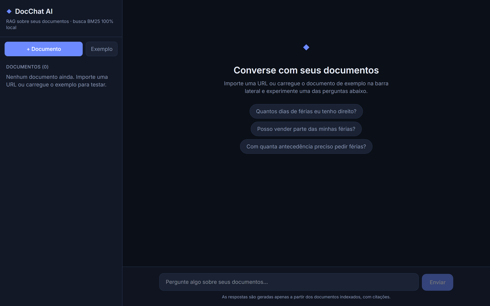
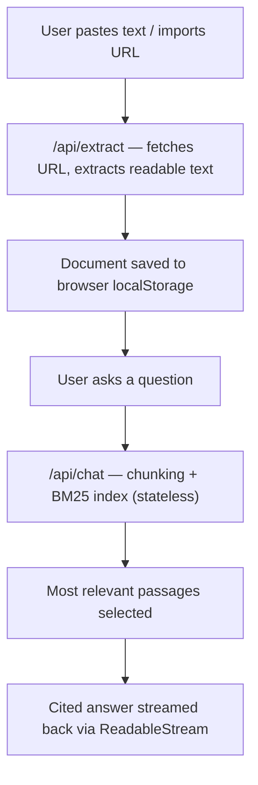

<!-- ══════════════════════════ TITLE ══════════════════════════ -->
<div align="center">
  
</div>

<!-- ══════════════════════ IDIOMAS / LANGUAGES ══════════════════════ -->
<div align="center">
<a href="README.md"></a>
<a href="README.en.md"></a>
<a href="README.es.md"></a>
</div>

<!-- ══════════════════════════ COVER ══════════════════════════ -->
<div align="center">
  
</div>

<br/>

<h1 align="center">DocChat AI</h1>
<p align="center"><em>Paste a document or import any web page by URL, ask questions in natural language, get cited answers</em></p>
<p align="center"><strong>Document → chunking → local BM25 index → cited streaming answer</strong></p>

<div align="center">


<br/>


</div>

<!-- ══════════════════════════ NAV ══════════════════════════ -->
<div align="center">

<a href="#about"></a>
<a href="#highlights"></a>
<a href="#architecture"></a>
<a href="#tech-stack"></a>
<a href="#usage"></a>

</div>

<br/>

> 💡 **No API keys, no vector database, no external service.** Retrieval runs 100% locally with a from-scratch BM25 implementation — `npm install && npm run dev` and it just works.

<!-- ══════════════════════════ ABOUT ══════════════════════════ -->
## About

**DocChat AI** is a full-stack **RAG (Retrieval-Augmented Generation)** app built from scratch: paste text or import any web page by URL, ask a question in natural language, and get **the most relevant passages from your sources, with inline citations** — no third-party AI provider, embedding service, or vector database involved.

Chunking, BM25 ranking, URL ingestion, streaming and UI: all hand-built, no AI framework underneath.

<!-- ══════════════════════════ HIGHLIGHTS ══════════════════════════ -->
## Highlights

| Feature | What it does |
|---|---|
| **From-scratch BM25** | Classic IR ranking (TF-IDF with length normalization), zero dependencies. Bilingual (PT/EN) tokenizer with accent folding and stopword removal |
| **Cited RAG** | Documents are chunked, indexed, and the most relevant passages come back as grounded, cited context |
| **Import by URL** | Paste a link and the server fetches the page, extracts readable text, and indexes it — no CORS headaches |
| **Streaming** | Answers render live via a `ReadableStream` |
| **Stateless / serverless-ready** | Documents live in the browser's `localStorage` and are sent with each question — no database to provision |
| **No external services** | No API key, no third-party AI provider, no vector DB — works offline |

<!-- ══════════════════════════ ARCHITECTURE ══════════════════════════ -->
## Architecture



| File | Responsibility |
|---|---|
| `src/lib/chunk.ts` | Splits documents into overlapping, boundary-aware chunks |
| `src/lib/bm25.ts` | Dependency-free BM25 ranking index + tokenizer |
| `src/lib/answer.ts` | Composes a cited answer from the retrieved passages |
| `src/app/api/extract` | Fetches a URL server-side, returns readable text |
| `src/app/api/chat` | Stateless retrieval + streamed, cited answer |
| `src/app/page.tsx` | Chat UI, document sidebar (localStorage), client-side streaming |

<!-- ══════════════════════════ TECH STACK ══════════════════════════ -->
## Tech Stack

| Layer | Technology |
|---|---|
| Framework | Next.js 15 (App Router, Route Handlers, streaming) |
| Language | TypeScript (strict) |
| UI | React 19, Tailwind CSS v4 |
| Retrieval | Custom BM25 — no vector DB, no AI provider |
| Deploy | Vercel, zero configuration |

<!-- ══════════════════════════ USAGE ══════════════════════════ -->
## Usage

```bash
npm install
npm run dev
```

Open [http://localhost:3000](http://localhost:3000), click **Exemplo** in the sidebar (or import a URL), and ask a question. No configuration, no API key.

**Tests:**
```bash
npm test
```
Covers the retrieval core — chunking boundaries and BM25 ranking.

<!-- ══════════════════════════ LICENSE ══════════════════════════ -->
## License

[MIT](LICENSE).

<div align="center">
  
</div>

<p align="center"><sub>Built by <strong><a href="https://github.com/geoggrigori">Grigori</a></strong> · 2026</sub></p>
