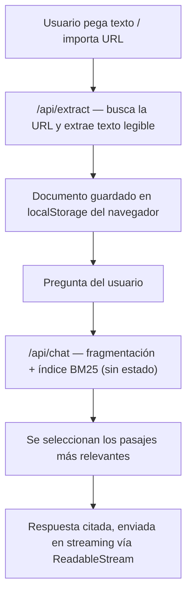

<!-- ══════════════════════════ TÍTULO ══════════════════════════ -->
<div align="center">
  
</div>

<br/>

<!-- ══════════════════════ IDIOMAS / LANGUAGES ══════════════════════ -->
<div align="center">
<a href="README.md"></a>
<a href="README.en.md"></a>
<a href="README.es.md"></a>
</div>

<br/>

<!-- ══════════════════════════ PORTADA ══════════════════════════ -->
<div align="center">
  
</div>

<br/>

<div align="center">


<br/>


</div>

<!-- ══════════════════════════ NAV ══════════════════════════ -->
<div align="center">

<a href="#acerca-de"></a>
<a href="#destacados"></a>
<a href="#arquitectura"></a>
<a href="#tecnologías"></a>
<a href="#uso"></a>

</div>

<br/>

> 💡 **Sin API keys, sin base de datos vectorial, sin servicio externo.** La búsqueda corre 100% local con BM25 escrito desde cero — `npm install && npm run dev` y ya funciona.

<!-- ══════════════════════════ ACERCA DE ══════════════════════════ -->
## Acerca de

**DocChat AI** es una app full-stack de **RAG (Retrieval-Augmented Generation)** construida desde cero: pega un texto o importa cualquier página por URL, haz una pregunta en lenguaje natural y recibe **los pasajes más relevantes de tus fuentes, con citas en línea** — sin depender de ningún proveedor de IA, servicio de embeddings o base de datos vectorial.

Fragmentación, ranking BM25, ingesta por URL, streaming y UI: todo hecho a mano, sin ningún framework de IA por detrás.

<!-- ══════════════════════════ DESTACADOS ══════════════════════════ -->
## Destacados

| Función | Qué hace |
|---|---|
| **BM25 desde cero** | Ranking clásico de IR (TF-IDF con normalización por longitud), cero dependencias. Tokenizador bilingüe (PT/EN) con normalización de acentos y remoción de stopwords |
| **RAG con citas** | Los documentos se fragmentan, se indexan y los pasajes más relevantes vuelven como contexto citado |
| **Importar por URL** | Pega un enlace y el servidor busca la página, extrae el texto legible y lo indexa — sin problemas de CORS |
| **Streaming** | Las respuestas se renderizan en vivo vía `ReadableStream` |
| **Sin estado / listo para serverless** | Los documentos viven en el `localStorage` del navegador y se envían con cada pregunta — sin base de datos que aprovisionar |
| **Cero servicios externos** | Sin API key, sin proveedor de IA externo, sin vector DB — funciona sin conexión |

<!-- ══════════════════════════ ARQUITECTURA ══════════════════════════ -->
## Arquitectura



| Archivo | Responsabilidad |
|---|---|
| `src/lib/chunk.ts` | Divide documentos en fragmentos superpuestos, respetando límites |
| `src/lib/bm25.ts` | Índice BM25 sin dependencias + tokenizador |
| `src/lib/answer.ts` | Compone la respuesta citada a partir de los pasajes recuperados |
| `src/app/api/extract` | Busca una URL en el servidor y devuelve texto legible |
| `src/app/api/chat` | Recuperación sin estado + respuesta citada en streaming |
| `src/app/page.tsx` | UI de chat, barra lateral de documentos (localStorage), streaming en el cliente |

<!-- ══════════════════════════ TECNOLOGÍAS ══════════════════════════ -->
## Tecnologías

| Capa | Tecnología |
|---|---|
| Framework | Next.js 15 (App Router, Route Handlers, streaming) |
| Lenguaje | TypeScript (strict) |
| UI | React 19, Tailwind CSS v4 |
| Recuperación | BM25 propio — sin vector DB, sin proveedor de IA |
| Deploy | Vercel, cero configuración |

<!-- ══════════════════════════ USO ══════════════════════════ -->
## Uso

```bash
npm install
npm run dev
```

Abre [http://localhost:3000](http://localhost:3000), haz clic en **Exemplo** en la barra lateral (o importa una URL) y haz una pregunta. Sin configuración, sin API key.

**Pruebas:**
```bash
npm test
```
Cubren el núcleo de recuperación — límites de fragmentación y ranking BM25.

<!-- ══════════════════════════ LICENCIA ══════════════════════════ -->
## Licencia

[MIT](LICENSE).

<div align="center">
  
</div>

<p align="center"><sub>Desarrollado por <strong><a href="https://github.com/geoggrigori">Grigori</a></strong> · 2026</sub></p>
