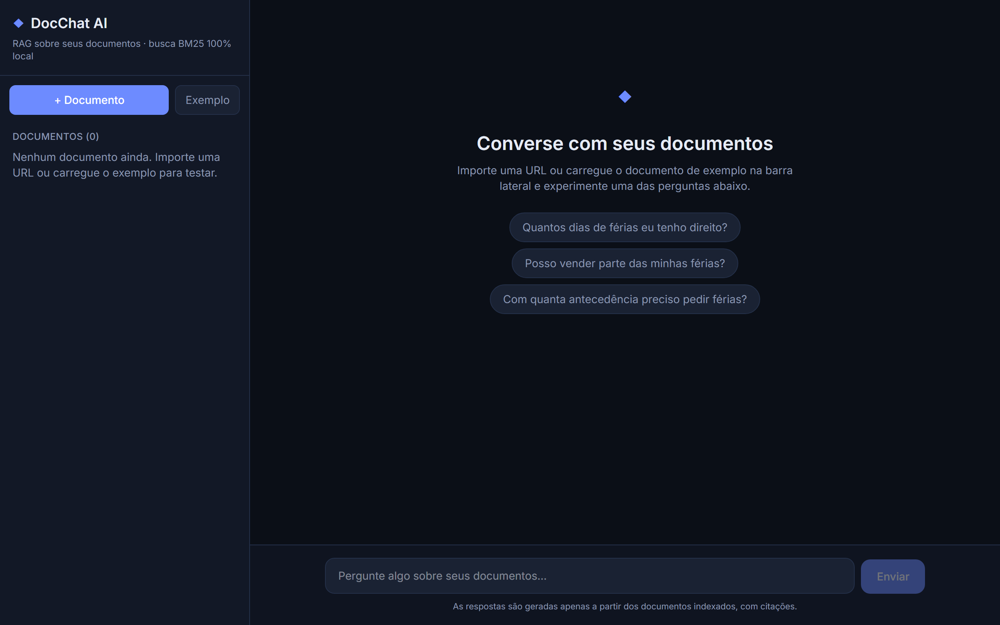
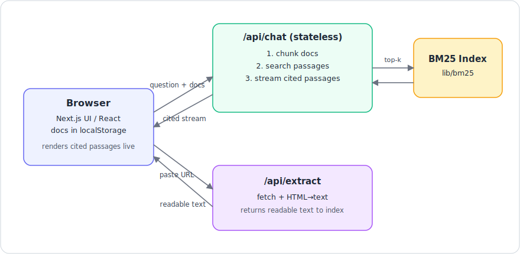

# DocChat AI 🔎

**English** · [Português](README.pt.md) · [Español](README.es.md)

Chat with your documents. Paste text **or import any web page by URL**, ask questions in natural language, and get **the most relevant passages from your sources, with inline citations** — powered by a from-scratch RAG (Retrieval-Augmented Generation) pipeline.

Retrieval runs **100% locally** (BM25, no embedding service, no vector database, no external API). The whole app is self-contained and needs no API keys to run.

> Built with Next.js 15 (App Router), React 19, TypeScript and Tailwind CSS v4.



---

## ✨ Features

- **From-scratch BM25 search** — the classic IR ranking function (term frequency × inverse document frequency with length normalization), implemented with zero dependencies. Bilingual (PT/EN) tokenizer with accent folding and stopword removal.
- **Retrieval-Augmented Generation** — documents are chunked, indexed, and the most relevant passages are retrieved per question and returned as grounded, cited context.
- **Cited results** — every passage references the document it came from, shown as source chips you can hover to preview.
- **Import by URL** — paste a link and the server fetches the page, strips it to readable text, and indexes it (no CORS headaches, done server-side).
- **Streaming responses** — results render live, using a `ReadableStream` over the Node boundary.
- **Stateless & serverless-ready** — documents live in the browser (`localStorage`) and are sent with each question, so the API holds no state and runs reliably on serverless platforms with no database to provision.
- **No external services** — no API keys, no third-party AI provider, no vector DB. It just works offline.
- **Polished dark UI** — responsive, accessible, keyboard-friendly (Enter to send, Shift+Enter for newline).

## 🏗️ Architecture



**Key modules**

| File | Responsibility |
|------|----------------|
| `src/lib/chunk.ts`        | Split documents into overlapping, boundary-aware chunks |
| `src/lib/bm25.ts`         | Dependency-free BM25 ranking index + tokenizer |
| `src/lib/answer.ts`       | Compose a cited result from the retrieved passages (local, streamed) |
| `src/app/api/extract`     | Fetch a URL server-side and return readable text |
| `src/app/api/chat`        | Stateless retrieval + streamed, cited result |
| `src/app/page.tsx`        | Chat UI, document sidebar (localStorage), streaming client |

## 🚀 Getting started

```bash
# 1. Install dependencies
npm install

# 2. Run the dev server
npm run dev
```

Open [http://localhost:3000](http://localhost:3000), click **Exemplo** in the sidebar (or import a URL), and ask a question. No configuration or API key needed.

## 🧪 Tests

```bash
npm test
```

Unit tests cover the retrieval core — chunking boundaries and BM25 ranking — the parts where correctness actually matters.

## 🛠️ Tech stack

- **Framework:** Next.js 15 (App Router, Route Handlers, streaming)
- **Language:** TypeScript (strict)
- **UI:** React 19, Tailwind CSS v4
- **Retrieval:** custom BM25 — no external vector DB, no AI provider

## 📦 Deploy

Deploys cleanly to [Vercel](https://vercel.com/) with **zero configuration** — the API is stateless (documents live in the browser), so there's no database to provision and no environment variables to set.

## 📝 Notes & possible extensions

- Add an optional answer-synthesis layer on top of retrieval (any LLM provider) behind a feature flag.
- Swap BM25 for vector embeddings + a hybrid reranker.
- Add PDF/DOCX parsing on upload.
- Per-user document spaces with auth + a shared datastore.

---

Made as a portfolio project to demonstrate full-stack engineering and applied information retrieval. Chunking, BM25 ranking, URL ingestion, streaming, and UI are all hand-built.
