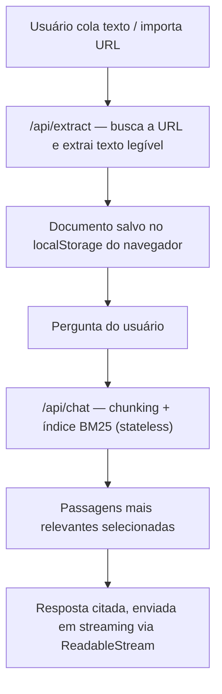

<!-- ══════════════════════════ TÍTULO ══════════════════════════ -->
<div align="center">
  
</div>

<br/>

<!-- ══════════════════════ IDIOMAS / LANGUAGES ══════════════════════ -->
<div align="center">
<a href="README.md"></a>
<a href="README.en.md"></a>
<a href="README.es.md"></a>
</div>

<br/>

<!-- ══════════════════════════ CAPA ══════════════════════════ -->
<div align="center">
  
</div>

<br/>

<h1 align="center">DocChat AI</h1>
<p align="center"><em>Converse com seus documentos: cole um texto ou importe uma página por URL, pergunte em linguagem natural e receba respostas citadas</em></p>
<p align="center"><strong>Documento → chunking → índice BM25 local → resposta com citação, em streaming</strong></p>

<div align="center">


<br/>


</div>

<!-- ══════════════════════════ NAVEGAÇÃO ══════════════════════════ -->
<div align="center">

<a href="#sobre"></a>
<a href="#destaques"></a>
<a href="#arquitetura"></a>
<a href="#tecnologias"></a>
<a href="#uso"></a>

</div>

<br/>

> 💡 **Sem API keys, sem banco vetorial, sem serviço externo.** A busca roda 100% localmente com BM25 escrito do zero — `npm install && npm run dev` e já funciona.

<!-- ══════════════════════════ SOBRE ══════════════════════════ -->
## Sobre

**DocChat AI** é um app full-stack de **RAG (Retrieval-Augmented Generation)** construído do zero: você cola um texto ou importa qualquer página por URL, faz uma pergunta em linguagem natural e recebe **as passagens mais relevantes das suas fontes, com citação inline** — sem depender de nenhum provedor de IA, embedding ou banco vetorial externo.

Chunking, ranking BM25, ingestão por URL, streaming e UI: tudo feito à mão, sem frameworks de IA por trás.

<!-- ══════════════════════════ DESTAQUES ══════════════════════════ -->
## Destaques

| Recurso | O que faz |
|---|---|
| **BM25 do zero** | Ranking clássico de IR (TF-IDF com normalização por tamanho), zero dependências. Tokenizador bilíngue (PT/EN) com remoção de acentos e stopwords |
| **RAG com citação** | Documentos são fatiados (chunking), indexados e as passagens mais relevantes voltam como contexto citado |
| **Importação por URL** | Cola um link e o servidor busca a página, extrai o texto legível e indexa — sem dor de cabeça de CORS |
| **Streaming** | Respostas renderizam ao vivo via `ReadableStream` |
| **Stateless / serverless-ready** | Documentos vivem no `localStorage` do navegador e são enviados a cada pergunta — API sem estado, sem banco para provisionar |
| **Zero serviços externos** | Sem chave de API, sem provedor de IA terceirizado, sem vector DB — funciona offline |

<!-- ══════════════════════════ ARQUITETURA ══════════════════════════ -->
## Arquitetura


```mermaid
flowchart TD
    A[Usuário cola texto / importa URL] --> B["/api/extract — busca a URL e extrai texto legível"]
    B --> C[Documento salvo no localStorage do navegador]
    C --> D[Pergunta do usuário]
    D --> E["/api/chat — chunking + índice BM25 (stateless)"]
    E --> F[Passagens mais relevantes selecionadas]
    F --> G[Resposta citada, enviada em streaming via ReadableStream]
```

| Arquivo | Responsabilidade |
|---|---|
| `src/lib/chunk.ts` | Divide documentos em chunks sobrepostos, respeitando limites |
| `src/lib/bm25.ts` | Índice BM25 sem dependências + tokenizador |
| `src/lib/answer.ts` | Compõe a resposta citada a partir das passagens recuperadas |
| `src/app/api/extract` | Busca uma URL no servidor e devolve texto legível |
| `src/app/api/chat` | Recuperação stateless + resposta citada em streaming |
| `src/app/page.tsx` | UI de chat, sidebar de documentos (localStorage), streaming no cliente |

<!-- ══════════════════════════ TECNOLOGIAS ══════════════════════════ -->
## Tecnologias

| Camada | Tecnologia |
|---|---|
| Framework | Next.js 15 (App Router, Route Handlers, streaming) |
| Linguagem | TypeScript (strict) |
| UI | React 19, Tailwind CSS v4 |
| Recuperação | BM25 próprio — sem vector DB, sem provedor de IA |
| Deploy | Vercel, zero configuração |

<!-- ══════════════════════════ USO ══════════════════════════ -->
## Uso

```bash
npm install
npm run dev
```

Abra [http://localhost:3000](http://localhost:3000), clique em **Exemplo** na sidebar (ou importe uma URL) e faça uma pergunta. Sem configuração, sem API key.

**Testes:**
```bash
npm test
```
Cobrem o núcleo de recuperação — limites de chunking e ranking BM25.

<!-- ══════════════════════════ LICENÇA ══════════════════════════ -->
## Licença

[MIT](LICENSE).

<div align="center">
  
</div>

<p align="center"><sub>Desenvolvido por <strong><a href="https://github.com/geoggrigori">Grigori</a></strong> · 2026</sub></p>
